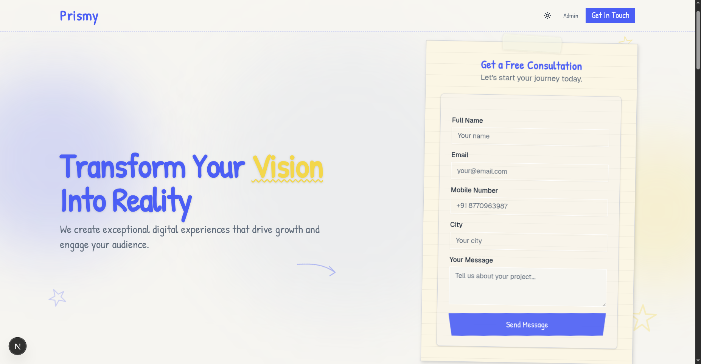
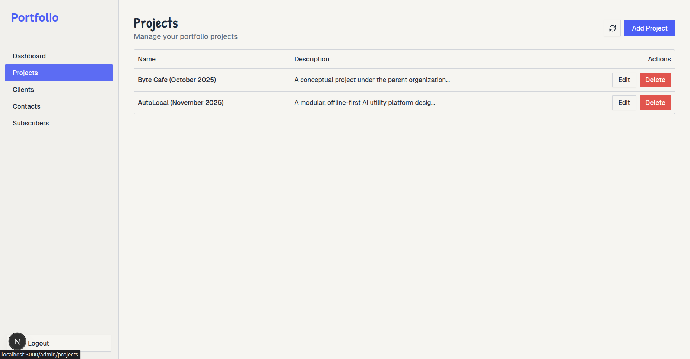
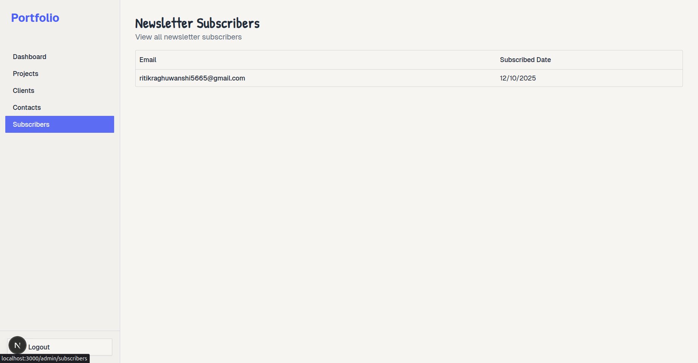
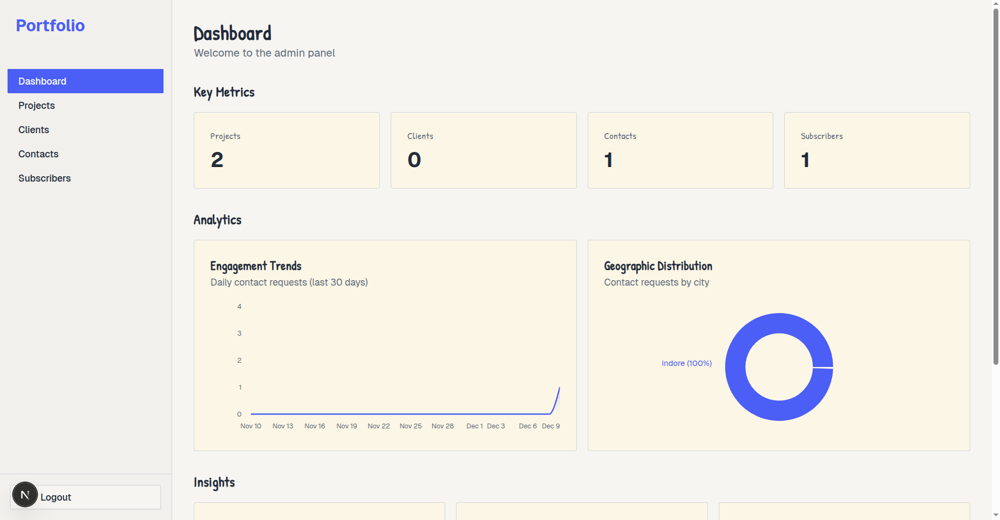
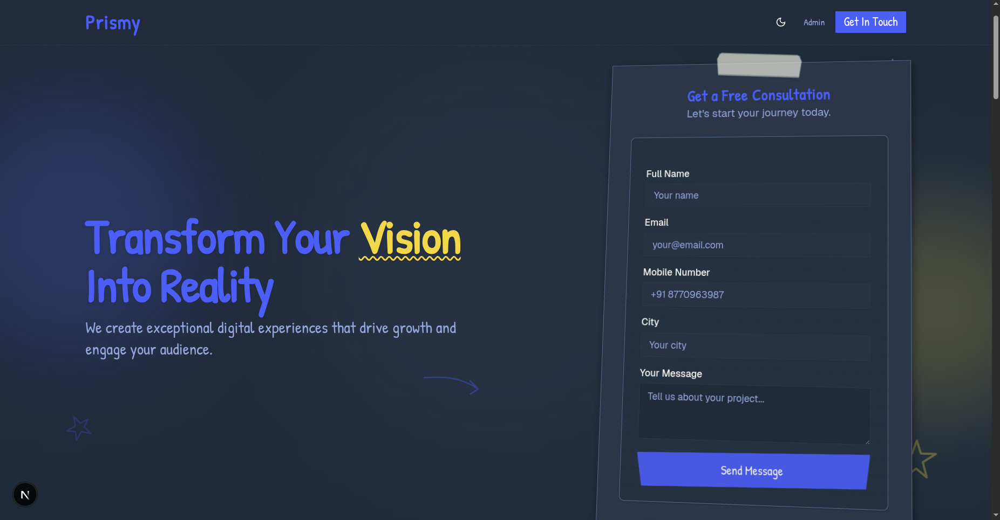
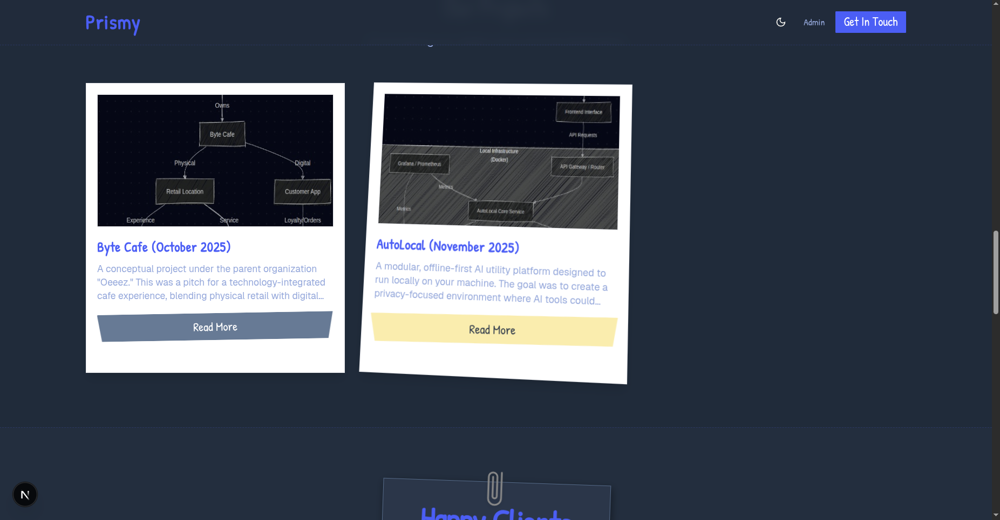
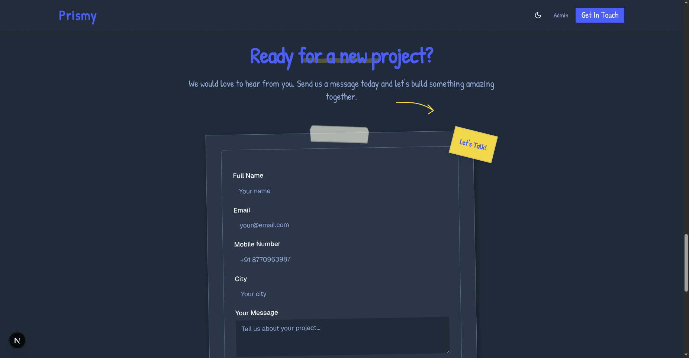

# 🌟 Full-Stack Portfolio Application

<div align="center">


**A modern, production-ready full-stack web application with a beautiful landing page, comprehensive admin dashboard, and real-time analytics.**

[Live Demo](#) • [Documentation](#-documentation) • [Setup Guide](#-quick-start)

</div>

---

## 📸 Screenshots

### Landing Page

<table>
<tr>
<td align="center" width="50%">

<br /><strong>Hero Section</strong><br />
Animated doodles, gradient blobs, and consultation form
</td>
<td align="center" width="50%">

<br /><strong>Projects Showcase</strong><br />
Dynamic project cards with hover animations
</td>
</tr>
<tr>
<td align="center">

<br /><strong>Client Testimonials</strong><br />
Paper-style cards with floating animations
</td>
<td align="center">

<br /><strong>Contact Form</strong><br />
Dual forms with toast notifications
</td>
</tr>
</table>

### Admin Dashboard

<table>
<tr>
<td align="center" width="50%">

<br /><strong>Analytics Dashboard</strong><br />
Engagement charts, city distribution, trends
</td>
<td align="center" width="50%">

<br /><strong>Projects Management</strong><br />
Full CRUD with image upload & cropping
</td>
</tr>
<tr>
<td align="center">

<br /><strong>Clients Management</strong><br />
Testimonial management with avatars
</td>
<td align="center">

<br /><strong>Contact Requests</strong><br />
View all inquiries with full details
</td>
</tr>
</table>

---

## ✨ Features

### 🎨 Landing Page
- **Hero Section** with animated gradient blobs and floating doodles
- **Projects Showcase** with 3D hover tilt and staggered animations
- **Client Testimonials** with paper-style cards and parallax effects
- **Contact Form** with validation and toast notifications
- **Newsletter Subscription** with email capture
- **Dual Theme System** – Blue/White ↔ Orange/Dark

### 📊 Admin Dashboard
- **Real-time Analytics** – Engagement trends, city distribution, conversion rates
- **Full CRUD Operations** for Projects and Clients
- **Image Upload** with cropping (450×350 for projects, 1:1 for clients)
- **Contact Management** – View all inquiries
- **Subscriber Management** – Track newsletter signups
- **Protected Routes** with Supabase Auth

### 🎭 Creative Design
- **Digital Sketchbook** aesthetic with paper textures
- **Smooth Animations** – Float, wiggle, fade-in, draw effects
- **Micro-interactions** – Hover states, focus rings, tilt effects
- **Accessibility** – Respects `prefers-reduced-motion`

---

## 🛠️ Tech Stack

| Category | Technologies |
|----------|--------------|
| **Frontend** | Next.js 14, React 19, TypeScript |
| **Styling** | Tailwind CSS v4, ShadCN UI |
| **Backend** | Supabase (PostgreSQL, Auth, Storage) |
| **Charts** | Recharts |
| **Forms** | React Hook Form + Zod validation |
| **Analytics** | Vercel Analytics |

---

## 🚀 Quick Start

### Prerequisites
- Node.js 20.9.0+
- npm or pnpm
- Supabase account

### 1. Clone & Install

```bash
git clone https://github.com/Harshit16g/full-stack-web-app
cd full-stack-web-app
npm install
```

### 2. Environment Setup

Create a `.env` file:

```env
NEXT_PUBLIC_SUPABASE_URL=your_supabase_url
NEXT_PUBLIC_SUPABASE_ANON_KEY=your_anon_key
SUPABASE_SECRET_KEY=your_secret_key
```

### 3. Database Setup

See [SETUP_DATABASE.md](./SETUP_DATABASE.md) for complete instructions.

**Quick version:**
1. Go to Supabase Dashboard → SQL Editor
2. Run `scripts/setup-db.sql`
3. Create storage bucket named `projects` (public)
4. Run `scripts/fix-storage-policies.sql`
5. Create admin user in Authentication

### 4. Run Development Server

```bash
npm run dev
```

Visit: **http://localhost:3000**

---

## 📁 Project Structure

```
full-stack-web-app/
├── app/
│   ├── actions/          # Server actions (CRUD)
│   ├── admin/            # Admin panel pages
│   ├── auth/             # Authentication
│   └── page.tsx          # Landing page
├── components/
│   ├── admin/
│   │   └── charts/       # Dashboard charts
│   ├── landing/          # Landing sections
│   └── ui/               # ShadCN + custom components
├── hooks/                # Custom React hooks
├── services/             # Business logic layer
├── types/                # TypeScript definitions
└── showcase_assets/      # Screenshots
```

---

## 🎨 Theme System

| Light Theme | Dark Theme |
|-------------|------------|
| Professional blue | Warm orange/red |
| Clean white background | Rich dark background |
| Perfect for business | Comfortable viewing |

**Toggle**: Click the sun/moon icon in the navbar

---

## 📊 Admin Dashboard Features

### Analytics
- **Engagement Chart** – 30-day rolling area chart
- **City Distribution** – Top 5 cities donut chart
- **Trend Card** – Week-over-week growth with indicators
- **Conversion Metric** – Contact → Subscriber funnel

### CRUD Operations
- ✅ Create, Read, Update, Delete for Projects
- ✅ Create, Read, Update, Delete for Clients
- ✅ Read-only for Contacts and Subscribers
- ✅ Image upload with cropping

---

## 🔐 Authentication

| Route | Access |
|-------|--------|
| `/` | Public |
| `/admin/*` | Protected (requires login) |
| `/auth/login` | Login page |

**Default Admin**: `admin@gmail.com` / `admin@123`

---

## 📚 Documentation

- **[SETUP_DATABASE.md](./SETUP_DATABASE.md)** – Complete database setup
- **[DEPLOYMENT.md](./DEPLOYMENT.md)** – Deployment instructions
- **[API_DOCUMENTATION.md](./API_DOCUMENTATION.md)** – API reference

---

## 🧪 Available Scripts

```bash
npm run dev         # Start development server
npm run build       # Build for production
npm run start       # Start production server
npm run lint        # Run ESLint
```

---

## 🚢 Deployment

### Vercel (Recommended)

1. Push code to GitHub
2. Import project in Vercel
3. Add environment variables
4. Deploy!

---

## 🎯 Features Checklist

- [x] Landing page with 8 sections
- [x] Admin dashboard with analytics
- [x] Full CRUD for projects/clients
- [x] Contact form & newsletter
- [x] Image upload with cropping
- [x] Dual theme system
- [x] Authentication & authorization
- [x] Smooth animations & micro-interactions
- [x] TypeScript throughout
- [x] Zero vulnerabilities

---

## 📝 License

This project is licensed under the MIT License.

---

<div align="center">

**Made with ❤️ using Next.js, Supabase, and modern web technologies**

</div>
